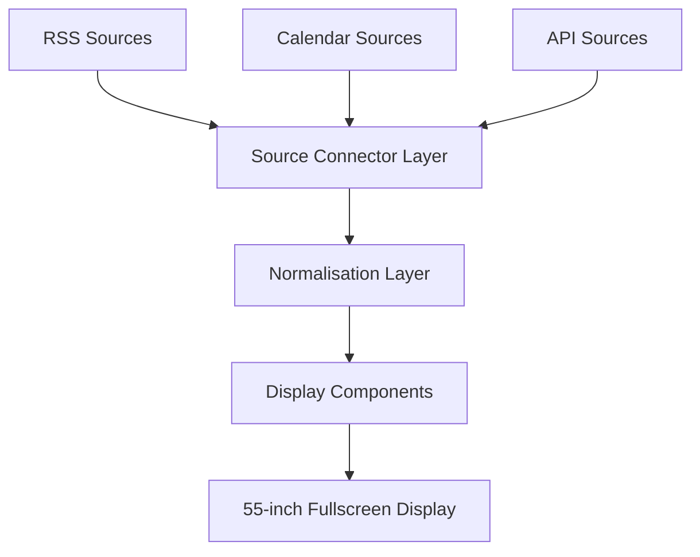
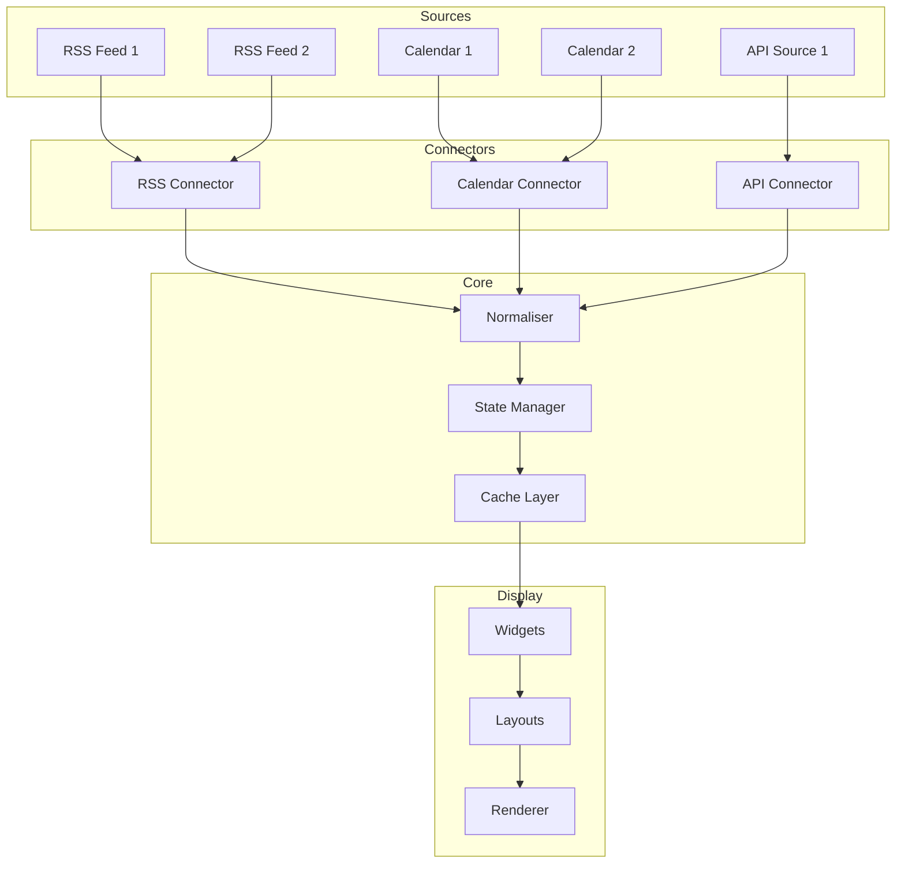
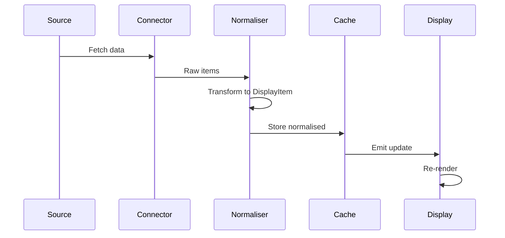
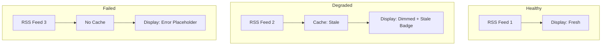
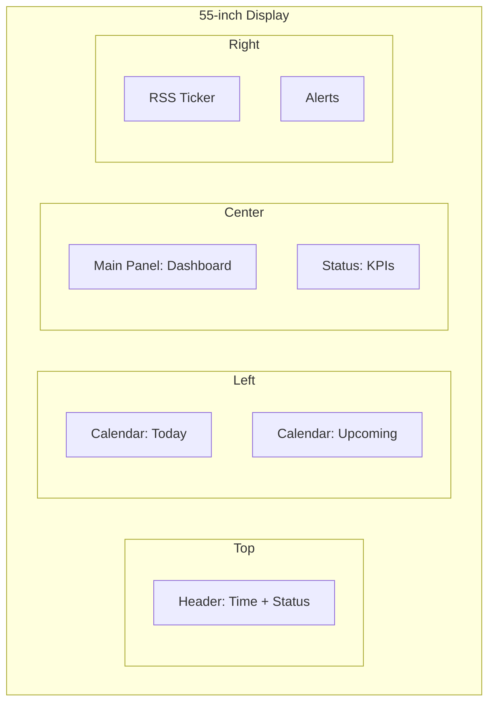
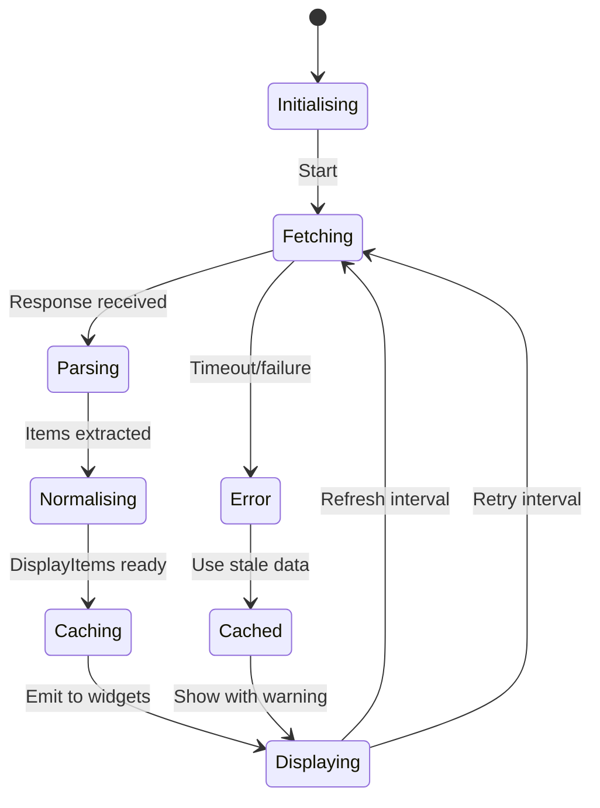

# DisplayForge Mermaid Diagrams

## Standalone Display with Source Connectors

## Source Isolation Model

## Normalisation Flow

## Failure Isolation

## Screen Layout Example

## Refresh Cycle

