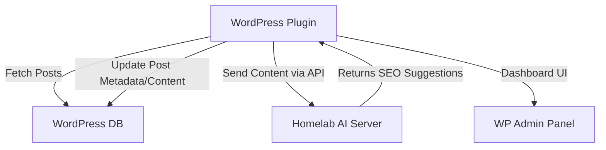
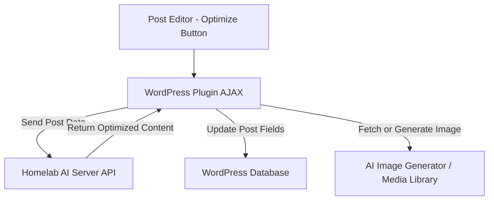
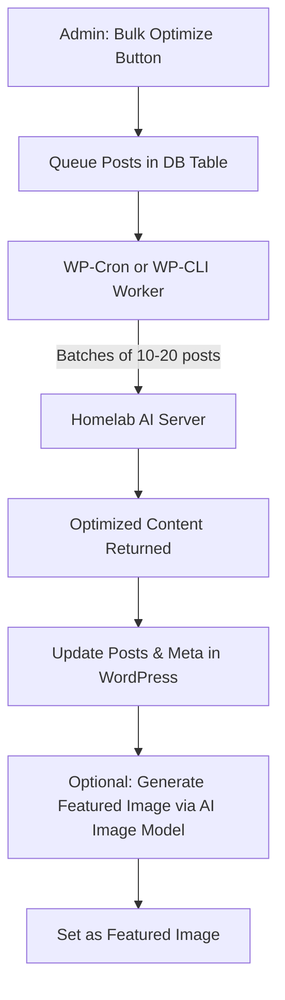
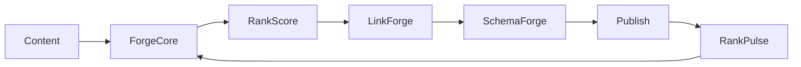
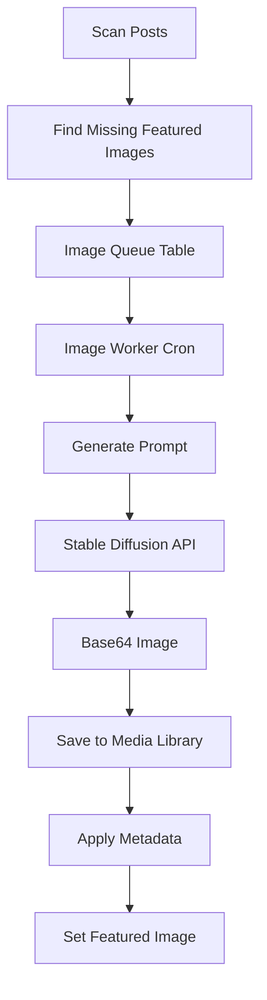
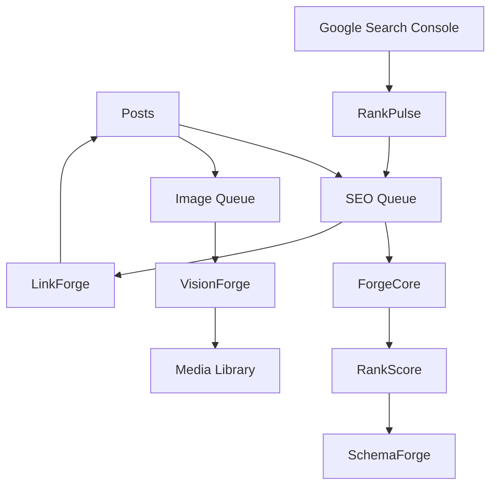
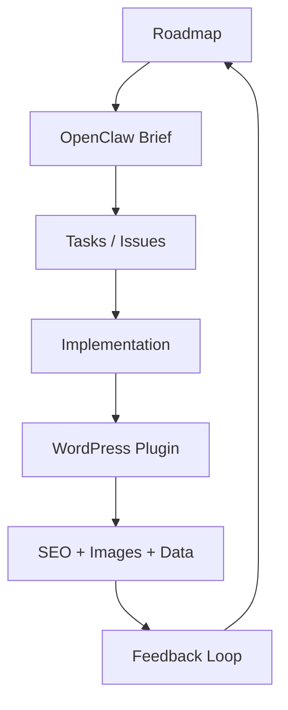

# RankForge Mermaid Diagrams — Part 1

This file contains the first half of the Mermaid diagrams used to design RankForge. Each diagram includes a short description so it is useful as documentation, not just decoration.

---

## 1. Initial Plugin Architecture

Description: Shows the original plugin concept. WordPress pulls posts, sends content to the homelab AI server, receives SEO suggestions, writes metadata/content back, and exposes control through the WP admin panel.



---

## 2. Per-Post Optimisation Architecture

Description: Shows the per-post workflow from the editor. A manual optimisation action sends the current post to the AI layer and writes improved content, metadata, and optional image results back to WordPress.



---

## 3. Bulk Queue Processing Architecture

Description: Describes the scale model for large sites. Instead of attempting everything at once, posts are queued and processed in controlled batches through cron or CLI workers.



---

## 4. v3.0 SEO Pipeline

Description: This is the strategic future-state pipeline. It combines content rewriting, schema generation, semantic internal linking, gap analysis, optional image generation, and search feedback into a closed-loop optimisation system.

```mermaid
flowchart TD
    A[Start: Queue New or Existing Posts] --> B[Batch Processor]
    B -->|Step 1| C[AI Content Rewriter]
    C -->|Optimized Title, Meta, Content, Keywords| D[Update Post Draft + AI Meta Fields]
    C -->|Step 2| E[Entity Extraction]
    E -->|JSON-LD Schema| D
    B -->|Step 3| F[Semantic Similarity Engine]
    F -->|Suggested Links & Anchor Text| G[wp_ai_internal_links Table]
    G -->|Admin Approval or Auto-insert| D
    B -->|Step 4| H[Gap Analysis + SEO Score]
    H -->|Score 0-100 & Missing Subtopics| I[wp_ai_seo_queue Table]
    I --> D
    B -->|Step 5 (Optional)| J[AI Image Generator]
    J -->|Featured Image| D
    D --> K[Sitemap Updated & Search Engines Pinged]
    L[Google Search Console API] --> M[Performance Data: CTR, Clicks, Impressions]
    M -->|Feed Data to AI| N[CTR Optimization Engine]
    N -->|New Meta Titles/Descriptions| D
    K --> O[Post Optimized + Links Added + Schema Updated]
    O --> P[Improved Rankings & Traffic]
```

---

## 5. Closed-Loop Product Concept

Description: Summarises RankForge as a closed-loop product rather than a simple plugin. Content enters the system, is scored and enriched, gets published, then performance feeds back into future optimisation.



---

## 6. Image Queue & Backfill Flow

Description: Shows the dedicated image backfill lane. Posts missing featured images are discovered, queued, turned into prompts, rendered through Stable Diffusion, saved into WordPress, and attached as featured images.



---

## 7. Product Phase Architecture

Description: Represents the planned product modules in the mature state. Separate queues feed into core scoring, schema, image generation, internal linking, and feedback systems.



---

## 8. Product Lifecycle Loop

Description: Maps how strategy becomes execution. The roadmap informs the OpenClaw brief, which becomes tasks, which become implementation, which then generate results and feedback that loop back into planning.


