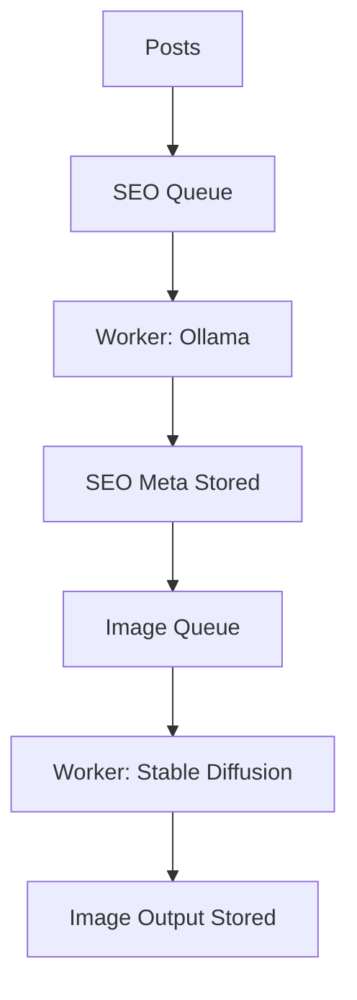
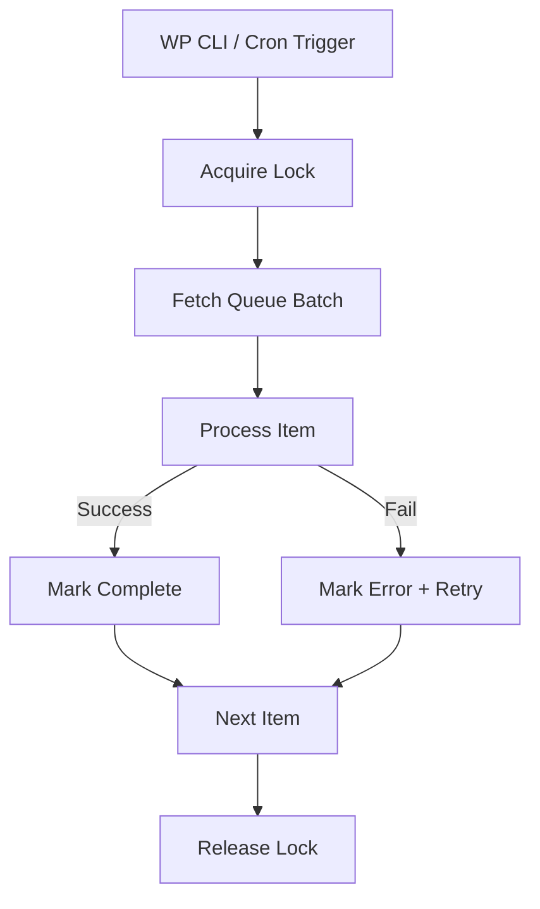
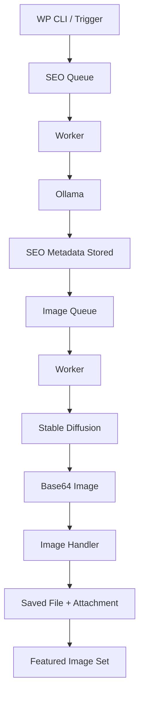
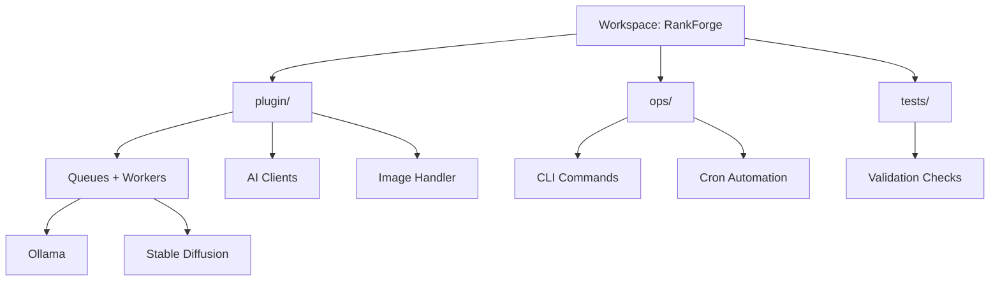
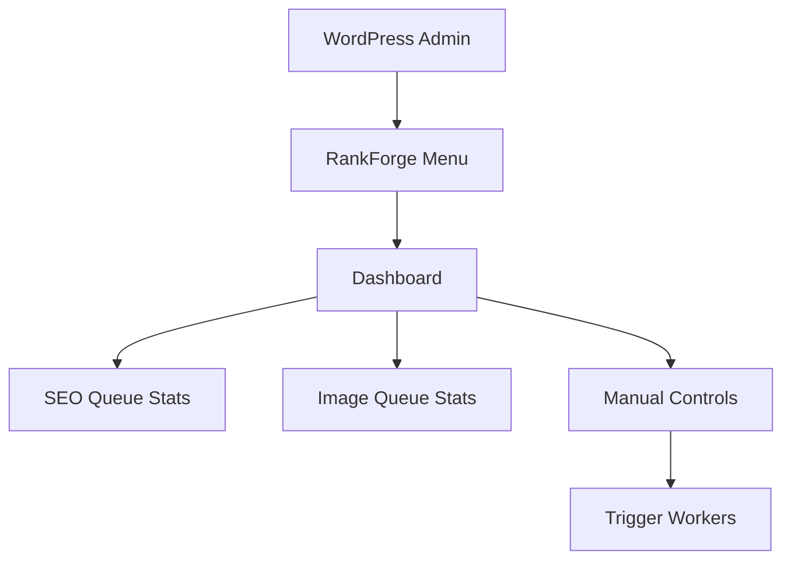
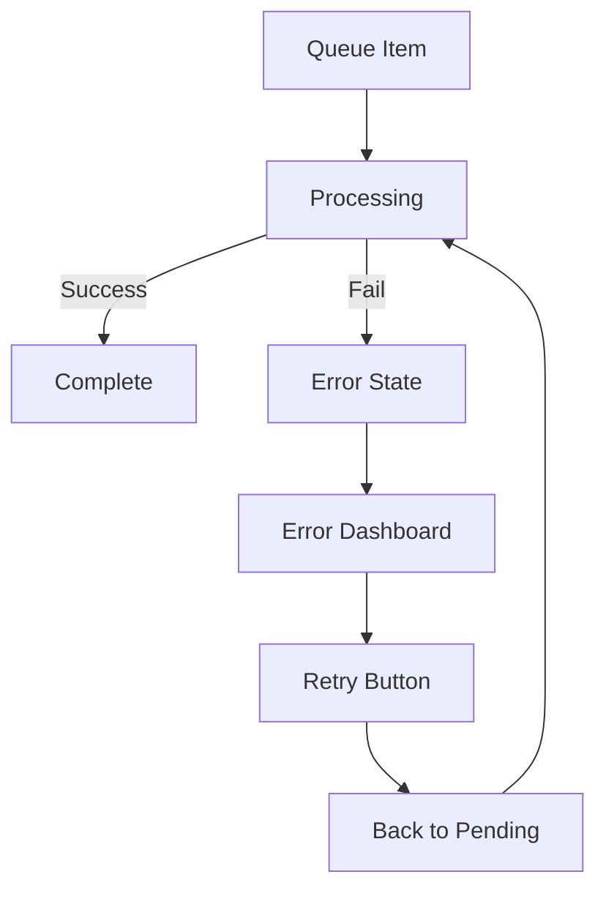
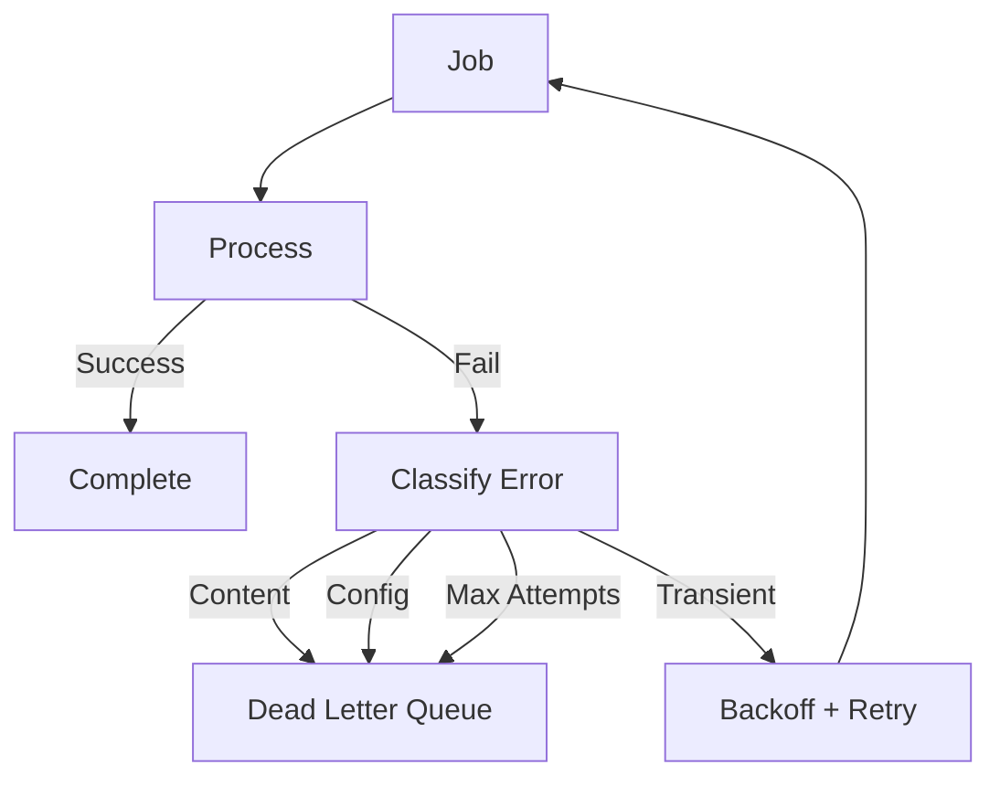

# RankForge Mermaid Diagrams — Part 2

This file contains the operational and system-level diagrams for RankForge, covering runtime processing, workspace structure, dashboards, and resilience patterns.

---

## 9. Plugin Queue Engine

Description: Shows the dual-queue design. SEO processing runs first via Ollama, then feeds into the image queue which generates and stores images.

---

## 10. Production Queue Processing

Description: Describes how batches are safely processed. Locks prevent concurrency issues, items are processed individually, and success or failure is tracked before moving to the next item.

---

## 11. Full Working Pipeline

Description: End-to-end view of the system. SEO optimisation runs first, followed by image generation, then storage and attachment back into WordPress.

---

## 12. Workspace Model

Description: Shows how RankForge is structured within the Forge repository. Plugin code, operations, and tests are separated but coordinated within a single workspace.

---

## 13. Dashboard Control Surface

Description: Represents the admin UI layer. Users can view queue states and manually trigger processing from within WordPress.

---

## 14. Retry / Error Loop

Description: Shows the basic retry mechanism. Failed jobs are surfaced to the dashboard, retried manually, and re-enter the processing loop.

---

## 15. Intelligent Retry + Backoff

Description: Advanced resilience model. Errors are classified, retried with exponential delay if appropriate, or moved to a dead-letter queue if not recoverable.

